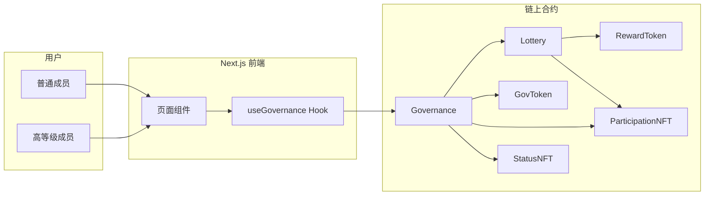
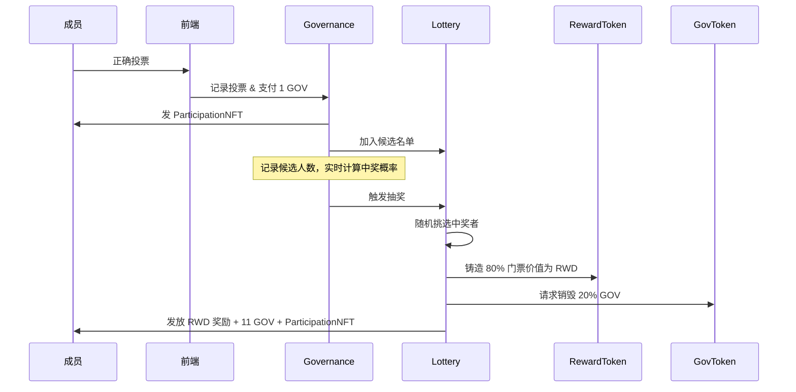
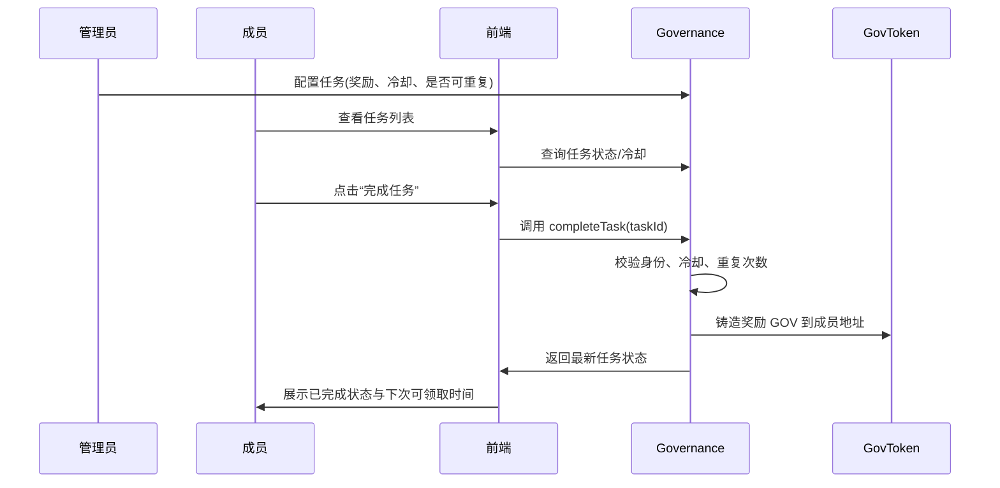
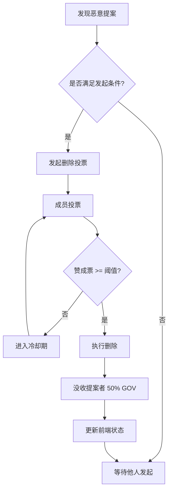

# 系统流程与状态图

本文档覆盖 DAO-Lottery-Plus 的核心业务流程，帮助开发者快速理解链上交互、前端展现以及关键状态的演变。所有内容均以中文撰写，可直接配合 README 一起阅读。

## 1. 模块关系总览

- `useGovernance` 负责将用户操作转换为合约调用，并拉取链上状态。
- `Governance` 是状态中心，决定提案、任务、抽奖和删除投票是否成立。
- `GovToken`、`RewardToken`、`ParticipationNFT`、`StatusNFT` 提供各种奖励和权限控制能力。

## 2. 抽奖概率与结算流程

- 抽奖概率 `p = 1 / 候选人数`，前端会根据合约返回的候选列表实时渲染。
- 奖励发放后候选列表清空，等待下一轮提案投票。

## 3. 任务奖励链路

- 冷却时间在链上强制执行，前端仅作为提示。
- 合约会记录每个成员的完成次数，支持一次性或重复型任务。

## 4. 恶意提案二次投票删除

### 4.1 角色与条件

| 成员等级 | 所需 GOV 门槛 | 说明 |
| --- | --- | --- |
| 王者 / 钻石 | 较低门槛（示例：20 GOV） | 高等级 NFT 持有者更容易发起/参与删除 |
| 黄金 / 白银 | 较高门槛（示例：50 GOV） | 允许低等级成员以更高代价参与 |

> 具体数值由 `Governance` 合约中的配置决定，可在部署或后续提案中修改。

### 4.2 流程图

- 在冷却期内无法再次发起删除同一提案，防止刷票。
- `slash` 直接调用 `GovToken` 内置的惩罚逻辑，确保惩罚在链上即时生效。

## 5. 前端状态同步要点

1. `useGovernance` 在每次链上交易成功后会自动触发 refetch，确保余额、NFT、提案状态即时更新。
2. `/governance` 页面提供三类提示：
   - 当前提案状态（活跃、已删除、已完成）。
   - 用户是否满足发起/投票条件。
   - 冷却时间倒计时与惩罚结果。
3. `/tasks` 页面通过链上返回的 `nextAvailableAt` 字段计算剩余冷却秒数，无需本地存储。

## 6. 建议的测试路径

1. **治理基础**：在本地网络中创建提案、投票、执行抽奖，确认概率与奖池金额与链上数据一致。
2. **任务激励**：尝试完成一次性任务和可重复任务，检查冷却与奖励发放。
3. **恶意提案删除**：使用不同等级的账户分别尝试发起、投票，验证门槛差异与惩罚机制。

> 若在无网络环境遇到 Solidity 编译器下载问题，可提前缓存 `~/.cache/hardhat-nodejs/compilers` 目录。

---

通过以上流程图与时序图，可以快速掌握 DAO-Lottery-Plus 的业务全貌，并在此基础上进行二次开发或审计。
